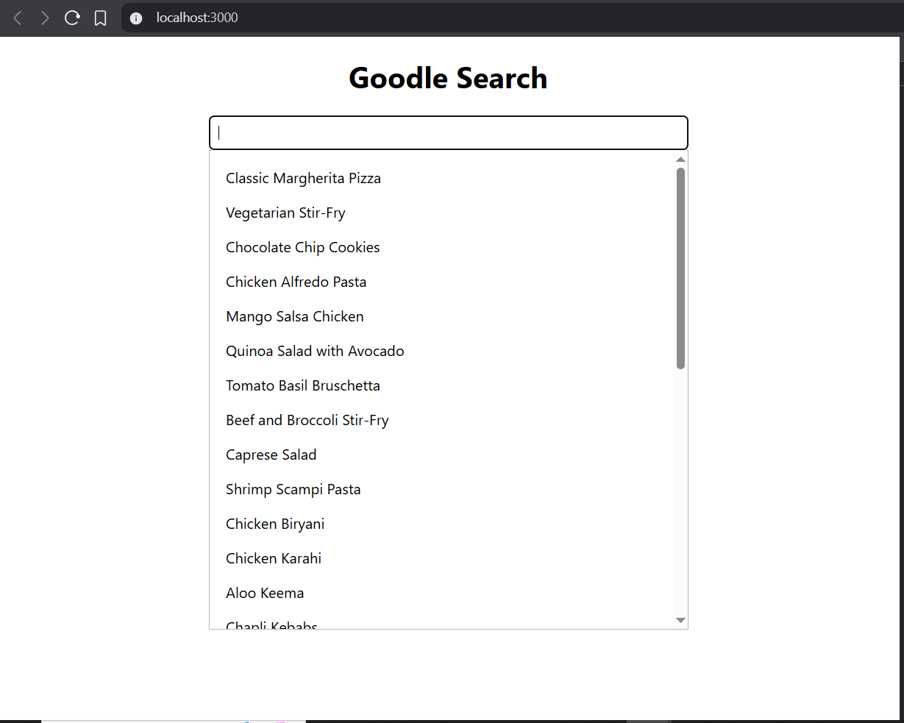

Create a Google Search with debouncing and Caching

const fetchData = async () => {
<!-- Yhan hum check kar rahe hain ki cache[input]/ma[ma] agr hai to setSearchData mein ma[ma] set kar do jo user ne type kia hai agr wo cache mein hai to set kar do -->
if (cache[input]) {
    console.log("Returning data from cache");
    setSearchData(cache[input]);
    return;
}

    const data = await fetch(`https://dummyjson.com/recipes/search?q=${input}`);
    const json = await data.json();

    setSearchData(json?.recipes);

    <!-- Caching with Cache State humne yhan object isliye liye hai taki jo bhi hum search tab mein likhenge wo key ban jaye or response uska value {ma : '', mango: ''} like hasMap type hoga ye -->

    setCache((prev) => ({
        ...prev,
        [input]: json.recipes
    }));
};
